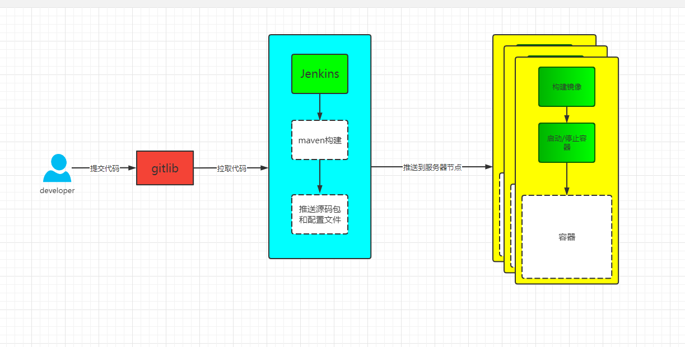

<div align="center">
<br/>
<br/>

  <h1 align="center">
    Jenkins-test
  </h1>
  <h4 align="center">
    jenkins multi branch pipeline demo

  </h4> 

</div>
<div align="center">
<p align="center">
    <a href="#">
        
    </a>
    <a href="#">
        
    </a>
</p>
</div>

# 使用教程

> 环境准备

1. 有在运行的Jenkins服务器并安装好相关插件如：SSH Pipeline Steps、Publish over SSH
等等   (没有的话自己搭建一个吧!)

2. 准备一台Linux服务器或者虚拟机并安装好Docker, 如果没有请看下面连接有我之前写过有关虚拟机安装教程

3. 准备一台Gitlab服务器或者注册一个GitHub账号存放源码

4. 最好有 Docker、Jenkins Pipeline、Shell 相关基础

[Multipass虚拟机安装入门教程](https://blog.csdn.net/zhourui2000/article/details/122272646)

[Windows10虚拟机安装和使用教程](https://blog.csdn.net/zhourui2000/article/details/122006354)


> 部署流程



> 流程说明

    由于示例只有一台服务器, 为了简化流程把jenkins服务器中构建镜像和推送到镜像仓库步骤省列了, 
    改成推送相关源码包和配置文件到节点服务器构建并部署

> 项目结构

```
jenkins-test
│
├─controller 公共资源
│	│
│	└─TestController 输出示例
│
├─resources 资源
│	│
│	└─deploy 镜像构建、启动、停止脚本
│  
└─ Jenkinsfile 整体部署流程控制脚本
```


